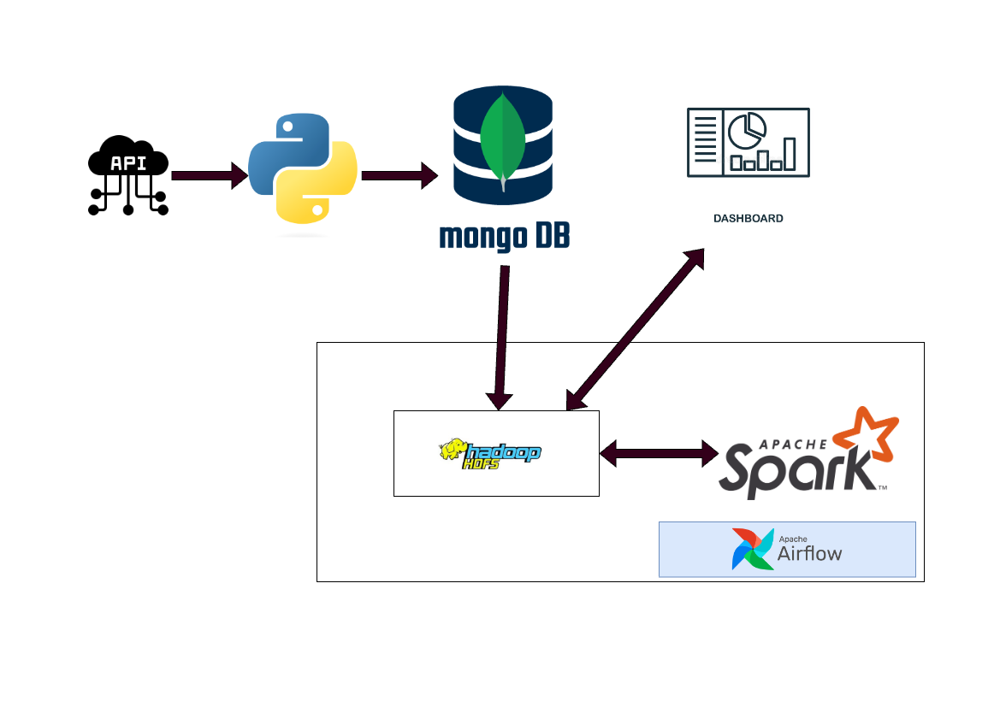
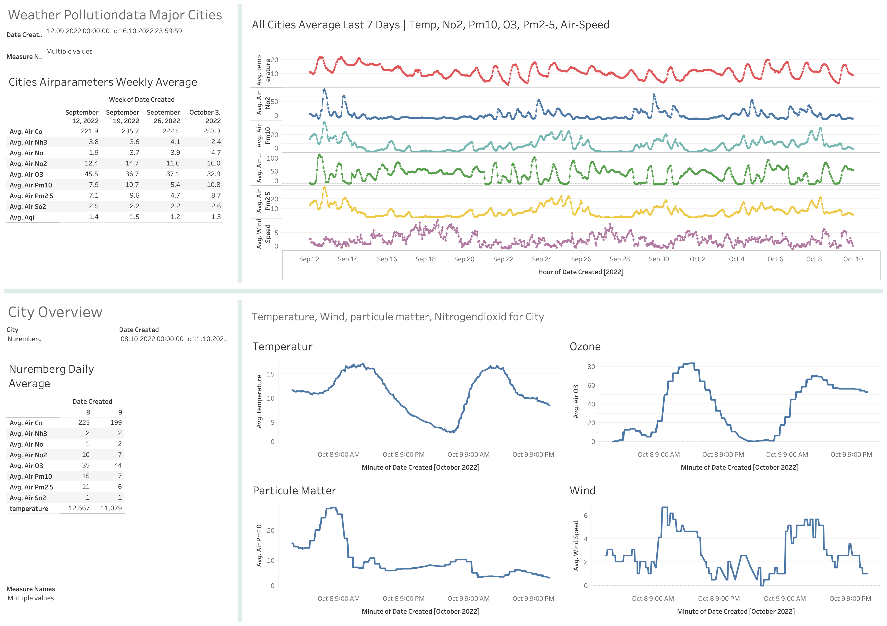

# datapipeline weatherscraper 
## Overview

## Description

This is a project, that collects weather and airpollution data. The collected data will first be ingested to a MongoDB.
Then using Airflow, the data will be extracted from the MongoDB to the Hadoop HDFs, transformed, and inserted into a relational DB.
Queries will be made to the relational DB to feature a Dashboard.

## Environments
- Local environment runs the python webscraper 
- Docker environment that launches spark / hive / hdfs / airflow (taken from Airflow Course from Marc Lamberti)

# the different components
## Webscraper
The webscraper was written as a small project to collect the names of the biggest cities in germany with \
with their respective latitude and longitude values.

## Python Data Collection Script
The Python script is written to collect concurrent weather and airpollutiondata at the time of execution. \
The collected data is written to the MongoDB. \
A Batch counter was implemented to be able to properly identify API calls of the same execution. \
The Script itsself is triggered by a Cronjob then every minute.

## Airflow DAG
The Airflow DAG is set up to run every day at midnight. It is made up of the following tasks: \
aggregationquery >> aggregationexport >> saving_export >> deleting_local >> creating_citydata_table >> weather_processing >> deleting_export \

#### <ins>Aggregationquery</ins>

Aggregate the Data within the MongoDB over 24 hours, by creating a new date field and output to a collection with the date as its name.

#### <ins>Aggregationexport</ins>
Export the collection from MongoDB locally.

#### <ins>saving_export</ins>
Transfer the local export to the Hadoop HDFS

#### <ins>deleting_local</ins>
Delete the local file, thats not needed at that point anymore.

#### <ins>creating_citydata_table</ins>
Within Hive, create the TABLE with the fields that one would like to populate.

#### <ins>weather_processing</ins>
Read the file that has been uploaded to HDFS. Define the structure of badly organized JSON data within the CSV File, in order to \
insert into the hive table

#### <ins>deleting_export</ins>
Delete the leftover file within the HDFS file system

## Tableau
Query the data from HDFS with Tableau.
